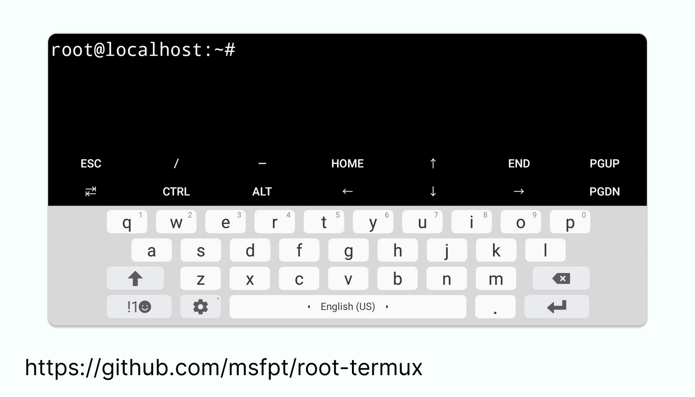

# root-termux

**install Root in the Termux**



## Usage

have you ever wanted to run scripts but they need root access or for some reason you want to enter your commands in the real linux environment? in this tutorial, it is executed only by running a Termux script in root mode.

### Run these commands in Termux:

```bash
# install git
pkg install git -y
```

```bash
# clone from github with git
git clone https://github.com/hctilg/root-termux.git && cd root-termux && chmod +x *
```

```bash
# install packages
pkg install wget proot -y
```

<br>

then enter the following command and go through the installation process:

```bash
# run bash script `install.sh`
bash install.sh  # or `./install.sh`
```

<br>

after installing and creating the executable file, run the root environment with the following command:

```bash
# run bash script `start.sh`
bash start.sh  # or `./start.sh`
```

<br>

Note: after running **Termux** as root, you need to install all the packages from the beginning, and be sure to update the terminal with the following commands after installation so that you don't have any problems installing the packages:

```bash
apt update
```

```bash
apt upgrade
```

<br>

command to install **sudo** after installing Ubuntu:

```bash
apt install sudo
```
